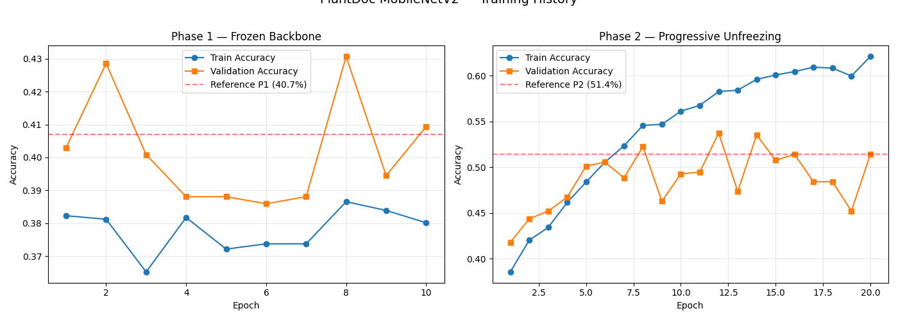
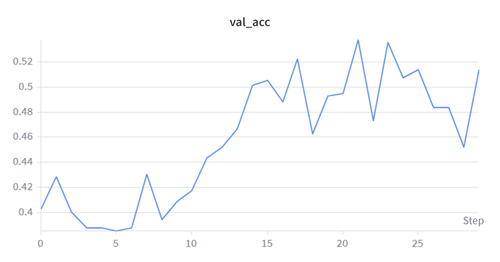
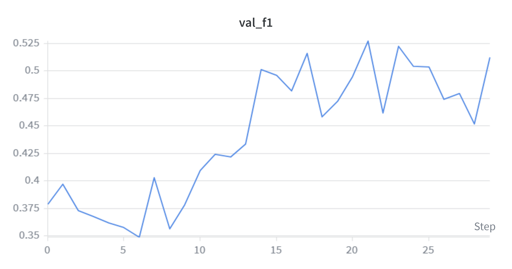
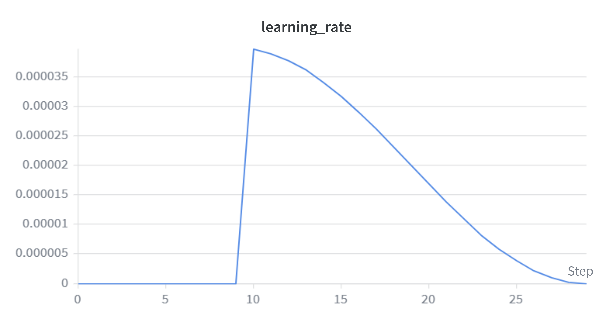

# 🌿 MobileNetV2 Transfer Learning for Plant Disease Detection

A deep learning project implementing transfer learning on MobileNetV2 for automated plant disease classification with a focus on domain adaptation and real-world robustness.

This project reproduces and improves a two-phase transfer learning pipeline for Plant Disease Detection using the PlantDoc dataset.

---

# 📋 Table of Contents

* [Project Overview](#-project-overview)
* [Model Architecture](#️-model-architecture)
* [Dataset Information](#-dataset-information)
* [Methodology](#-methodology)
* [Training Pipeline](#-training-pipeline)
* [Results](#-results)
* [Performance Analysis](#-performance-analysis)
* [Training Visualizations](#-training-visualizations)
* [Experiment Tracking](#-experiment-tracking)
* [Technologies Used](#️-technologies-used)
* [Installation](#-installation)
* [Usage](#-usage)
* [Key Findings](#-key-findings)
* [Developer](#-developer)

---

# 🌱 Project Overview

This project tackles real-world plant disease detection using transfer learning and computer vision.

Starting from a pretrained MobileNetV2 model, a two-phase fine-tuning strategy was implemented to adapt the model from controlled laboratory images to noisy real-world agricultural field images.

### Key Objectives

* Improve model performance on out-of-distribution field data
* Implement efficient transfer learning strategies
* Maintain lightweight inference using MobileNetV2
* Achieve robust multi-class classification across 28 disease classes
* Improve domain adaptation from PlantVillage → PlantDoc

---

# 🏗️ Model Architecture

## Base Network

| Component          | Details                     |
| ------------------ | --------------------------- |
| Architecture       | MobileNetV2                 |
| Framework          | HuggingFace Transformers    |
| Input Resolution   | 224 × 224                   |
| Feature Extractor  | 16 inverted residual blocks |
| Final Feature Size | 1280                        |
| Output Classes     | 28                          |

---

## Custom Classification Head

```python
Sequential(
    Linear(1280 → 640)
    ReLU()
    Linear(640 → 320)
    Dropout(p=0.1)
    ReLU()
    Linear(320 → 28)
)
```

---

# 📊 Dataset Information

## Source Model Training — PlantVillage

| Feature     | Details               |
| ----------- | --------------------- |
| Images      | 10,878                |
| Classes     | 38                    |
| Environment | Controlled Laboratory |

---

## Transfer Learning — PlantDoc

| Split      | Images |
| ---------- | ------ |
| Train      | 1,873  |
| Validation | 469    |
| Test       | 236    |
| Total      | 2,578  |

### Domain Adaptation Challenge

PlantVillage contains clean laboratory images while PlantDoc contains:

* real-world field conditions
* varying lighting
* cluttered backgrounds
* blur and camera noise
* inconsistent image quality

---

# 🔬 Methodology

## Two-Phase Transfer Learning

### Phase 1 — Frozen Backbone Training

* Freeze MobileNetV2 backbone
* Train custom classifier head only
* Fixed BatchNorm layers in eval mode
* AdamW optimizer + warmup scheduler

### Result

* Validation Accuracy: 43.1%

---

### Phase 2 — Progressive Fine-Tuning

* Unfreeze last 3 MobileNetV2 blocks
* Keep BatchNorm frozen
* Fine-tune deeper feature representations
* Cosine Annealing Scheduler

### Result

* Best Validation Accuracy: 53.7%
* Final Test Accuracy: 45.76%

---

# 🔄 Training Pipeline

```text
PlantVillage Pretrained Model
            ↓
Freeze Backbone
            ↓
Train Custom Classifier
            ↓
Progressive Unfreezing
            ↓
Fine-Tune Deep Features
            ↓
Evaluate on PlantDoc
```

---

# 📈 Results

| Metric | Baseline | Final Model | Improvement |
|---|---|---|---|
| Validation Accuracy | 40.7% | 53.7% | +13.0% |
| Test Accuracy | 19.49% | 45.76% | +26.27% |
| Weighted F1 Score | 47.0% | 43.74% | -3.26% |

---

## Key Improvements Over Baseline

- Improved validation accuracy by **13%**
- Improved real-world PlantDoc test accuracy by **26.27%**
- Successfully adapted MobileNetV2 from laboratory images to noisy field images
- Improved domain generalization using progressive fine-tuning
- Achieved stronger feature adaptation using BatchNorm stabilization

---

# 📉 Performance Analysis

| Stage         | Accuracy |
| ------------- | -------- |
| Early Phase 1 | 12.4%    |
| Final Phase 1 | 43.1%    |
| Final Phase 2 | 53.7%    |

---

# 📸 Training Visualizations

## Complete Training History



---

## Validation Accuracy



---

## Validation F1 Score



---

## Training Loss


---

## Validation Loss


---

## Learning Rate Schedule



---


# 📊 Experiment Tracking

Tracked using Weights & Biases:

* train loss
* validation loss
* validation accuracy
* weighted F1 score
* learning rate
* epoch metrics
* batch loss

---

# ⚙️ Technologies Used

| Technology   | Purpose             |
| ------------ | ------------------- |
| Python       | Programming         |
| PyTorch      | Deep Learning       |
| Transformers | HuggingFace Models  |
| Torchvision  | Image Processing    |
| WandB        | Experiment Tracking |
| Scikit-learn | Metrics             |
| Google Colab | GPU Training        |

---

# 🚀 Installation

## Google Colab Setup (T4 GPU)

```python id="m7q2x5"
# Install dependencies
!pip install -q transformers datasets wandb scikit-learn
```

```python id="x4n8p1"
# Login to Weights & Biases (optional)
import wandb
wandb.login()
```

```python id="k8m3q1"
# Verify GPU availability
import torch

print(f"GPU Available: {torch.cuda.is_available()}")
print(f"GPU Name: {torch.cuda.get_device_name(0) if torch.cuda.is_available() else 'None'}")
```

# 💻 Usage

## Model Loading

```python id="u2q8dn"
from transformers import MobileNetV2ForImageClassification

# Load pretrained model
model = MobileNetV2ForImageClassification.from_pretrained(
    "linkanjarad/mobilenet_v2_1.0_224-plant-disease-identification"
).to('cuda')
```

---

## Inference Example

```python id="h5v1ls"
from transformers import AutoImageProcessor
from PIL import Image

# Load processor and image
processor = AutoImageProcessor.from_pretrained(
    "linkanjarad/mobilenet_v2_1.0_224-plant-disease-identification"
)

image = Image.open("plant_leaf.jpg")

# Preprocess and predict
inputs = processor(
    images=image,
    return_tensors="pt"
).to('cuda')

outputs = model(**inputs)

predictions = outputs.logits.argmax(-1)

print(f"Predicted class: {predictions.item()}")
```

# 🔍 Key Findings

## Two-Phase Transfer Learning

Implemented a MobileNetV2 transfer learning pipeline for real-world plant disease classification using the PlantDoc dataset.

### Phase 1 — Frozen Backbone Training

* Freeze MobileNetV2 backbone
* Train custom classifier head only
* Keep BatchNorm layers fixed in eval mode
* AdamW optimizer with warmup scheduling

### Result

* Validation Accuracy: **43.1%**

---

### Phase 2 — Progressive Fine-Tuning

* Unfreeze final 3 MobileNetV2 blocks
* Fine-tune deeper feature representations
* Maintain frozen BatchNorm statistics
* Cosine Annealing scheduler

### Result

* Best Validation Accuracy: **53.7%**
* Final Test Accuracy: **45.76%**
* Weighted F1 Score: **43.74%**

---

## Domain Adaptation Challenge

PlantVillage contains clean laboratory images while PlantDoc contains:

* varying lighting conditions
* cluttered backgrounds
* blur and camera noise
* inconsistent image quality
* real-world agricultural field conditions

---

## Key Training Improvements

* Custom 3-layer classifier head improved feature adaptation
* Progressive unfreezing stabilized transfer learning
* Data augmentation improved generalization performance
* Fixed BatchNorm prevented pretrained feature drift
* Cosine scheduling improved Phase 2 fine-tuning stability

---

## Technical Highlights

* 28-class multi-class classification pipeline
* HuggingFace Transformers + PyTorch implementation
* GPU training on Google Colab T4
* Experiment tracking using Weights & Biases
* Transfer learning with MobileNetV2
* Real-world agricultural computer vision application

# 👨‍💻 Developer

## Chinmoy Deb

### VIT Vellore

AI • Deep Learning • Computer Vision 🌱

---

# 📅 Last Updated

May 2026
