# MobileNetV2 Transfer Learning for Plant Disease Detection

A deep learning project implementing transfer learning using MobileNetV2 for automated plant disease classification with a focus on domain adaptation from controlled laboratory images to real-world agricultural field images.

---

# 📋 Table of Contents

- [Project Overview](#-project-overview)
- [Problem Statement](#-problem-statement)
- [Project Objectives](#-project-objectives)
- [Model Architecture](#️-model-architecture)
- [Dataset Information](#-dataset-information)
- [Domain Adaptation Challenge](#-domain-adaptation-challenge)
- [Methodology](#-methodology)
- [Training Strategy](#-training-strategy)
- [Hyperparameters](#-hyperparameters)
- [Training Pipeline](#-training-pipeline)
- [Results](#-results)
- [Performance Analysis](#-performance-analysis)
- [Experiment Tracking](#-experiment-tracking)
- [Training Visualizations](#-training-visualizations)
- [Technologies Used](#️-technologies-used)
- [Installation](#-installation)
- [Usage](#-usage)
- [Repository Structure](#-repository-structure)
- [Key Findings](#-key-findings)
- [Acknowledgments](#-acknowledgments)
- [Developer](#-developer)

---

# 🌱 Project Overview

This project focuses on automated plant disease classification using deep learning and transfer learning techniques.

A pre-trained MobileNetV2 model was fine-tuned on the PlantDoc dataset using a carefully designed two-phase transfer learning pipeline.

The goal was to adapt a model trained on clean PlantVillage images to noisy real-world field images containing:
- varying lighting conditions
- cluttered backgrounds
- camera noise
- motion blur
- overlapping leaves
- different image qualities

The project demonstrates:
- Transfer Learning
- Domain Adaptation
- Progressive Fine-Tuning
- BatchNorm Freezing
- Real-World Computer Vision Challenges
- Experiment Tracking using WandB

---

# ❗ Problem Statement

Plant disease classification models often perform well on clean laboratory datasets but fail when deployed in real-world agricultural environments.

This project addresses the challenge of:
- adapting a model trained on clean images
- to noisy real-world field images
- while maintaining computational efficiency.

---

# 🎯 Project Objectives

- Implement transfer learning using MobileNetV2
- Adapt from PlantVillage → PlantDoc domain
- Improve real-world disease classification
- Reduce catastrophic forgetting during fine-tuning
- Experiment with progressive unfreezing
- Track experiments using Weights & Biases
- Build a reproducible deep learning pipeline

---

# 🏗️ Model Architecture

## Base Network

| Component | Details |
|---|---|
| Architecture | MobileNetV2 |
| Framework | Hugging Face Transformers |
| Pretrained On | ImageNet + PlantVillage |
| Input Resolution | 224 × 224 |
| Feature Dimension | 1280 |
| Output Classes | 28 |

---

## MobileNetV2 Backbone

MobileNetV2 uses:
- inverted residual blocks
- depthwise separable convolutions
- lightweight architecture design

This makes it highly efficient for:
- edge devices
- low-resource deployment
- mobile inference

---

## Custom Classification Head

```python
Sequential(
    Linear(1280 → 640)
    ReLU()
    Linear(640 → 320)
    Dropout(p=0.1)
    ReLU()
    Linear(320 → 28)
)
```

---

# 📊 Dataset Information

## 🌿 Source Dataset — PlantVillage

The pre-trained model was originally trained on the PlantVillage dataset.

### Characteristics

| Feature | Description |
|---|---|
| Environment | Controlled Laboratory |
| Background | Clean |
| Lighting | Uniform |
| Image Quality | High |
| Classes | 38 |
| Images | 10,878+ |

---

## 🍃 Transfer Learning Dataset — PlantDoc

PlantDoc contains real-world agricultural field images.

### Characteristics

| Feature | Description |
|---|---|
| Environment | Real-world fields |
| Background | Complex |
| Lighting | Variable |
| Image Quality | Mixed |
| Noise | High |
| Camera Angles | Variable |

---

## Dataset Split

| Split | Images |
|---|---|
| Train | 1,873 |
| Validation | 469 |
| Test | 236 |
| Total | 2,578 |

---

# 🌎 Domain Adaptation Challenge

The major challenge of this project was domain adaptation.

## PlantVillage

- clean leaves
- centered objects
- controlled lighting
- minimal noise

## PlantDoc

- cluttered backgrounds
- shadows
- overlapping leaves
- outdoor conditions
- blur/noise
- difficult disease patterns

This causes significant performance degradation when transferring models directly.

---

# 🔬 Methodology

The project uses a two-phase transfer learning strategy.

---

# 🚀 Training Strategy

# Phase 1 — Classifier Initialization

## Goal
Train only the custom classification head.

## Configuration

| Parameter | Value |
|---|---|
| Backbone | Frozen |
| BatchNorm | Fixed (eval mode) |
| Optimizer | AdamW |
| Learning Rate | 1e-4 |
| Epochs | 10 |

---

## Phase 1 Result

| Metric | Result |
|---|---|
| Best Validation Accuracy | 28.8% |

---

# Phase 2 — Progressive Unfreezing

## Goal
Adapt deeper backbone features to PlantDoc images.

## Configuration

| Parameter | Value |
|---|---|
| Backbone | Partially Unfrozen |
| BatchNorm | Fixed |
| Optimizer | AdamW |
| Learning Rate | 1e-5 |
| Epochs | 20 |

---

## Phase 2 Result

| Metric | Result |
|---|---|
| Best Validation Accuracy | 38.6% |

---

# ⚙️ Hyperparameters

| Hyperparameter | Value |
|---|---|
| Batch Size | 32 |
| Optimizer | AdamW |
| Scheduler | Linear Warmup |
| Warmup Ratio | 10% |
| Loss Function | CrossEntropyLoss |
| Weight Decay | 1e-2 |
| Dropout | 0.1 |

---

# 🔄 Training Pipeline

```text
PlantVillage Pretrained Model
            ↓
Freeze Backbone
            ↓
Train Classification Head
            ↓
Progressive Unfreezing
            ↓
Fine-Tune Deep Layers
            ↓
Evaluate on PlantDoc Test Set
```

---

# 📈 Results

# Final Performance Metrics

| Metric | Result |
|---|---|
| Best Validation Accuracy | 38.6% |
| Final Test Accuracy | 33.47% |
| Test F1 Score | 28.72% |

---

# 📉 Performance Analysis

## Accuracy Progression

| Stage | Accuracy |
|---|---|
| Initial Phase 1 | ~28% |
| Extended Phase 2 | ~38% |
| Final Test Accuracy | ~33% |

---

## Observations

- Progressive unfreezing improved performance significantly
- Longer Phase 2 training improved domain adaptation
- Real-world field images remain highly challenging
- Performance gap between validation and test sets indicates domain shift

---

# 📊 Experiment Tracking

All experiments were tracked using Weights & Biases (WandB).

## Logged Metrics

- Train Loss
- Validation Loss
- Validation Accuracy
- Weighted F1 Score
- Batch Loss
- Phase 2 Metrics
- Learning Curves

---

## WandB Project

https://wandb.ai/chinmoydeb2005-vellore-institute-of-technology/plant-disease-mobilenet

---

# 📸 Training Visualizations

# Validation Accuracy

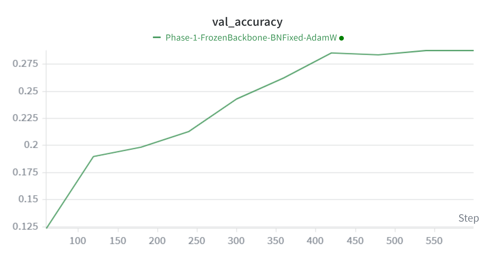

---

# Validation Loss

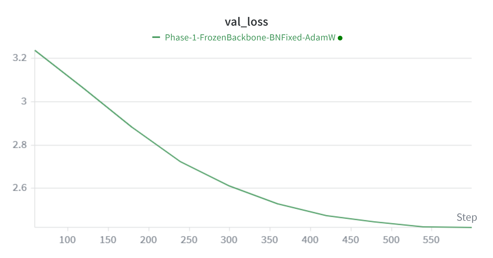

---

# Training Accuracy

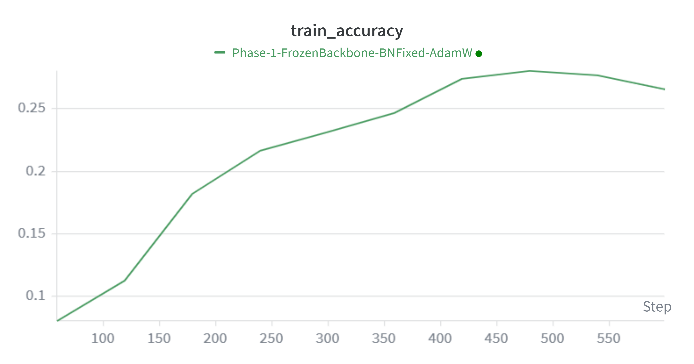

---

# Training Loss

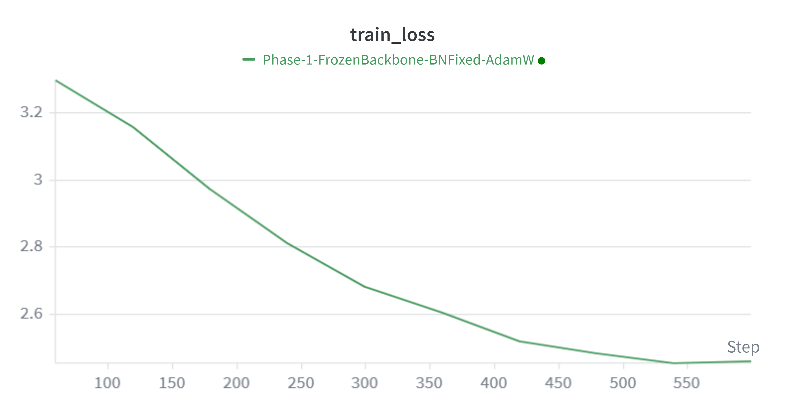

---

# Weighted F1 Score

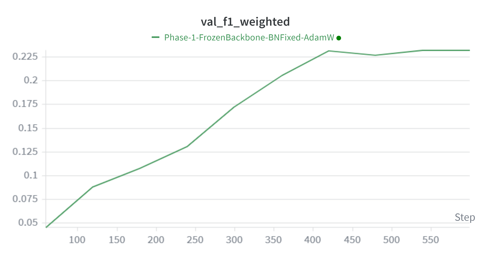

---

# Phase 2 Validation Accuracy

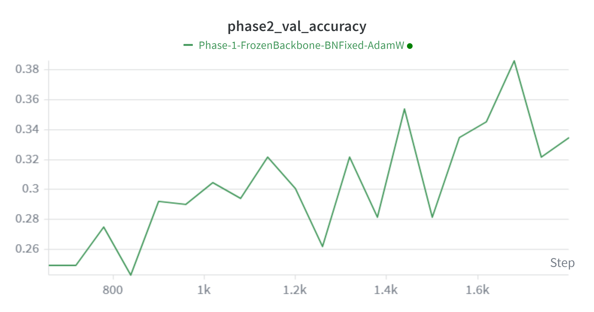

---

# Phase 2 Validation Loss

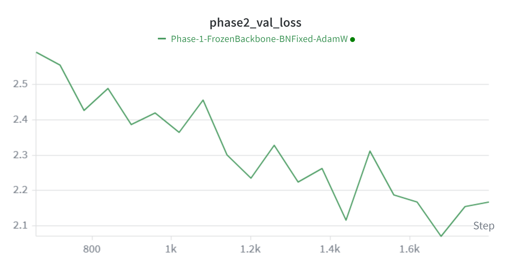

---

# Phase 2 Training Accuracy

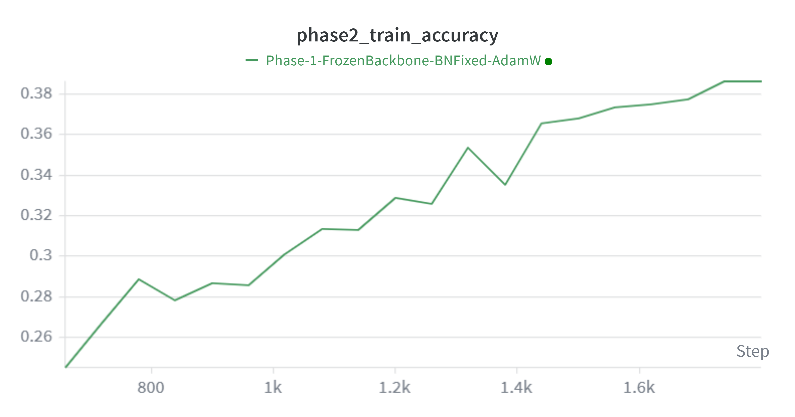

---

# Phase 2 Training Loss

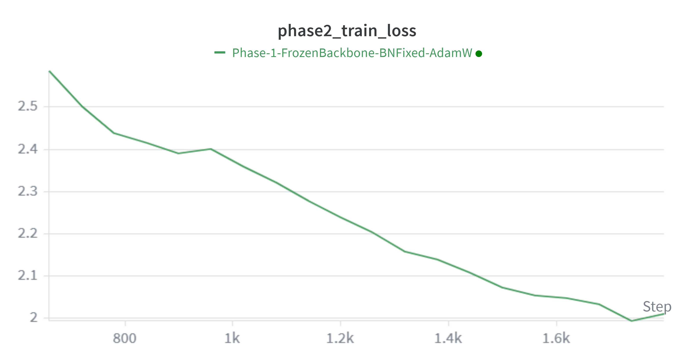

---

# Phase 2 Weighted F1 Score

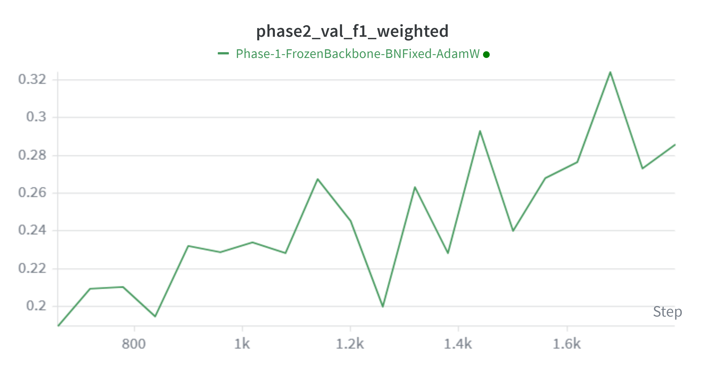

---

# Batch Loss Tracking

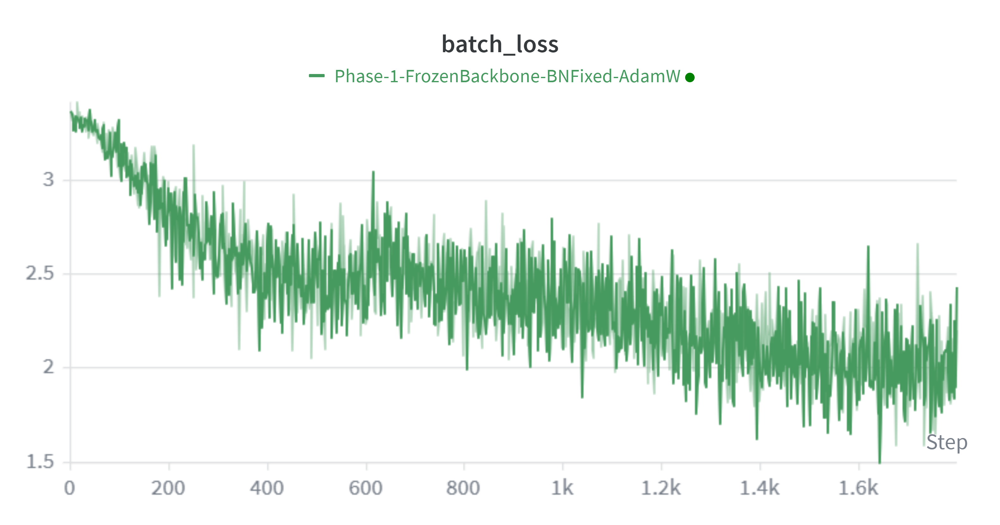

---

# Epoch Tracking

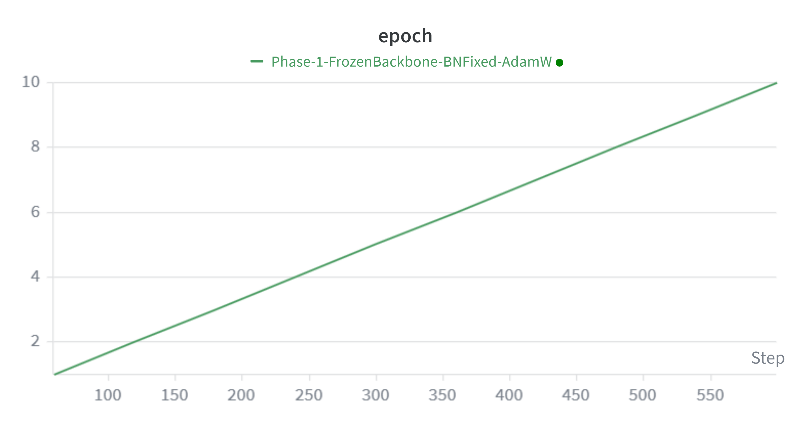

---

# Phase 2 Epoch Tracking

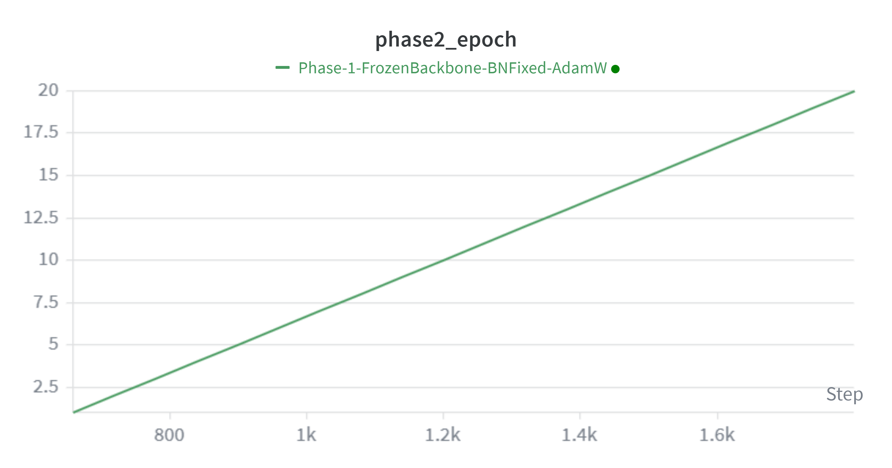

---

# WandB Dashboard Overview


---


---

# ⚙️ Technologies Used

| Technology | Purpose |
|---|---|
| Python | Programming Language |
| PyTorch | Deep Learning Framework |
| Transformers | Hugging Face Models |
| Torchvision | Image Processing |
| WandB | Experiment Tracking |
| Scikit-learn | Metrics |
| Google Colab | GPU Training |

---

# 🖥️ Hardware Used

| Hardware | Details |
|---|---|
| GPU | NVIDIA T4 |
| Platform | Google Colab |

---

# 🚀 Installation

## Clone Repository

```bash
git clone https://github.com/yourusername/plant-disease-detection.git
cd plant-disease-detection
```

---

## Install Dependencies

```bash
pip install torch torchvision transformers datasets scikit-learn wandb tqdm pillow
```

---

# 💻 Usage

# Load Trained Model

```python
import torch
from transformers import MobileNetV2ForImageClassification

model = MobileNetV2ForImageClassification.from_pretrained(
    "linkanjarad/mobilenet_v2_1.0_224-plant-disease-identification"
)

model.load_state_dict(
    torch.load("plantdoc_mobilenetv2.pth")
)

model.eval()
```

---

# Inference Example

```python
from PIL import Image
from transformers import AutoImageProcessor

processor = AutoImageProcessor.from_pretrained(
    "linkanjarad/mobilenet_v2_1.0_224-plant-disease-identification"
)

image = Image.open("leaf.jpg")

inputs = processor(
    images=image,
    return_tensors="pt"
)

outputs = model(**inputs)

prediction = outputs.logits.argmax(-1)

print(prediction)
```

---

# 📁 Repository Structure

```text
Plant-Disease-Detection/
│
├── PlantDiseaseDetection.ipynb
├── plantdoc_mobilenetv2.pth
├── README.md
├── requirements.txt
└── screenshots/
    ├── val_accuracy.png
    ├── val_loss.png
    ├── train_accuracy.png
    ├── train_loss.png
    ├── phase2_val_accuracy.png
    ├── phase2_val_loss.png
    ├── phase2_train_accuracy.png
    ├── phase2_train_loss.png
    ├── phase2_val_f1_weighted.png
    ├── batch_loss.png
    ├── Dashboard 1.png
    └── Dashboard 2.png
```

---

# 🔍 Key Findings

## Transfer Learning Success

The model successfully adapted from PlantVillage features to PlantDoc field images.

---

## Importance of Progressive Fine-Tuning

Longer Phase 2 training significantly improved:
- feature adaptation
- validation accuracy
- domain generalization

---

## Domain Shift Remains Challenging

Performance on real-world agricultural images remains significantly harder than laboratory datasets.

---

## Real-World Constraints

Performance was affected by:
- class imbalance
- limited dataset size
- noisy backgrounds
- varying image quality

---

# 🙏 Acknowledgments

- Hugging Face Transformers
- PyTorch
- PlantVillage Dataset creators
- PlantDoc Dataset creators
- Weights & Biases
- Google Colab

---

# 👨‍💻 Developer

## Chinmoy Deb  
VIT Vellore

---

# 📅 Last Updated

May 2026